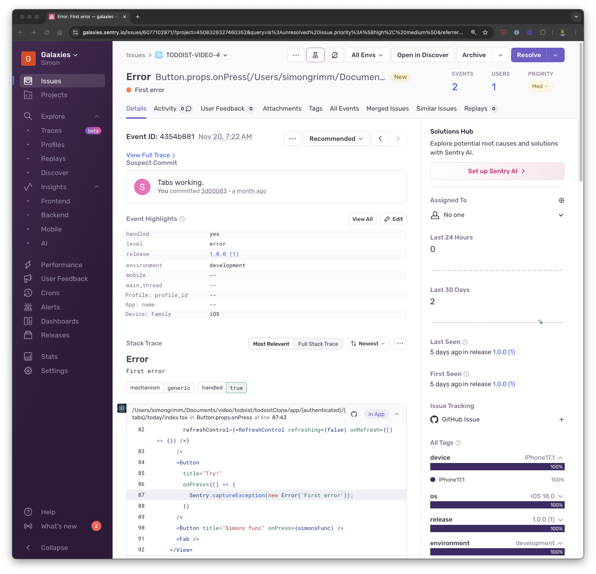

# React Native Todoist Clone with Clerk, RevenueCat & Sentry

This is a React Native Todoist clone using [Clerk](https://go.clerk.com/WKHSBp0) for user authentication and [RevenueCat](https://www.revenuecat.com/docs/getting-started/installation/reactnative?utm_medium=sponsored&utm_source=youtube&utm_campaign=SimonGrimm) for in-app purchases and subscriptions.

For improved debuggability, we've added [Sentry](https://sentry.io/welcome?utm_source=simongrimm&utm_medium=paid-community&utm_campaign=mobile-fy25q3-builders&utm_content=partner-react-native-mobile-learnmore&code=simongrimm) to the project.

Additional features:

- [Expo Router](https://docs.expo.dev/routing/introduction/) file-based navigation
- [Expo SQLite](https://docs.expo.dev/versions/latest/sdk/sqlite/) for storing chats and messages
- [Sentry](https://docs.sentry.io/platforms/react-native/?utm_source=simongrimm&utm_medium=paid-community&utm_campaign=mobile-fy25q3-builders&utm_content=partner-react-native-mobile-trysentry&code=simongrimm) for error tracking
- [RevenueCat](https://www.revenuecat.com/docs/getting-started/installation/reactnative?utm_medium=sponsored&utm_source=youtube&utm_campaign=SimonGrimm) for subscription management
- [React Hook Form](https://react-hook-form.com/) for form handling
- [Calendars](https://github.com/wix/react-native-calendars) for calendar component
- [Bouncy Checkbox](https://github.com/wix/react-native-bouncy-checkbox) for checkbox component
- [Haptics](https://docs.expo.dev/versions/latest/sdk/haptics/) for haptic feedback
- [Reanimated](https://docs.swmansion.com/react-native-reanimated/) 3 for animations
- [Gesture Handler](https://docs.swmansion.com/react-native-gesture-handler/) for gestures
- [RN MMKV](https://github.com/mrousavy/react-native-mmkv) for efficient key/value storage
- [Sonner Native](https://gunnartorfis.github.io/sonner-native/) for toast notifications

## Setup

### Environment Setup

Make sure you have the [Expo CLI](https://docs.expo.dev/get-started/set-up-your-environment/) installed.

Because we are using pre-built and a custom development client, you should download [Android Studio](https://developer.android.com/studio) and [Xcode](https://developer.apple.com/xcode/) to your Mac. For more information on setting up your development environment, refer to the [Expo documentation](https://docs.expo.dev/workflow/android-studio-emulator/) for Android Studio and the [React Native documentation](https://reactnative.dev/docs/environment-setup?guide=native) for Xcode.

### App Setup
To build the app, perform the following steps:

1. Clone the repository
2. Run `npm install`
3. Run `npx expo prebuild`
4. Run `npx expo run:ios` or `npx expo run:android`

## Sentry Setup

1. Create a [Sentry](https://sentry.io/welcome?utm_source=simongrimm&utm_medium=paid-community&utm_campaign=mobile-fy25q3-builders&utm_content=partner-react-native-mobile-learnmore&code=simongrimm) account and project
2. Go to **Project Settings** and select **Client Keys**
3. Copy the DSN and add it to the `.env` file

## App Screenshots

## Demo

## Sentry Screenshots

## 🚀 More

**Take a shortcut from web developer to mobile development fluency with guided learning**

Enjoyed this project? Learn to use React Native to build production-ready, native mobile apps for both iOS and Android based on your existing web development skills.

